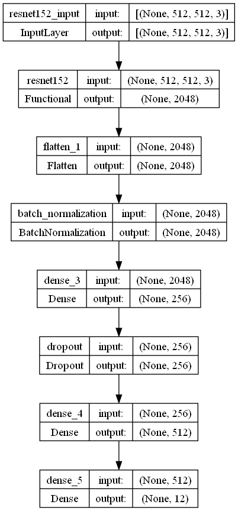
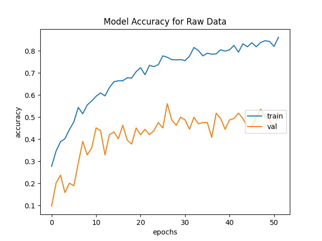
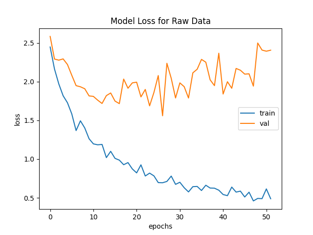

# SoleSleuth

A performance analysis of raw and masked images to predict the size of the shoe from shoe imprints retrieved from a crime scene.

## Introduction

Shoe imprints can help to narrow down a list of suspects in a crime scene. The shoe imprint can be used to identify the size of the shoe, which in turn can be used to approximately calculate the height of the person who wore the shoe. Hence, shoe imprints are an important piece of crime scene evidence.
SoleSleuth is a neural network based on the ResNet152 model, and helps predict the size of the shoe from the shoe imprint. 

## Dataset

The dataset can be found [here](https://iastate.figshare.com/articles/figure/2D_Footwear_outsole_impressions/11624073/1) and contains 2D images of shoe imprints. The dataset contains 12 classes of different shoe sizes, ranging from 7-13. 

## Methodology

The dataset was split into training and validation sets, with 80% of the data being used for training and 20% for validation. The images were resized to 512x512 and normalized. The ResNet152 model was used as the base model, and the last layer was replaced with a fully connected layer with 12 output nodes. The model was trained for 100 epochs, with a batch size of 32. The model was trained on an RTX 3080 Ti Laptop GPU The model was trained using the RMSprop optimizer, with a learning rate of 0.001. 

    
    

        SoleSleuth Model Architecture
    

## Results

The model achieved an accuracy of 86.1% on the training set and 50% on the validation set. The reason for the poor performance on the validation set is that the dataset is not large enough, and is also imbalanced.

    
    

        Accuracy plot with raw images
    

    
    

        Loss plot with raw images
    

